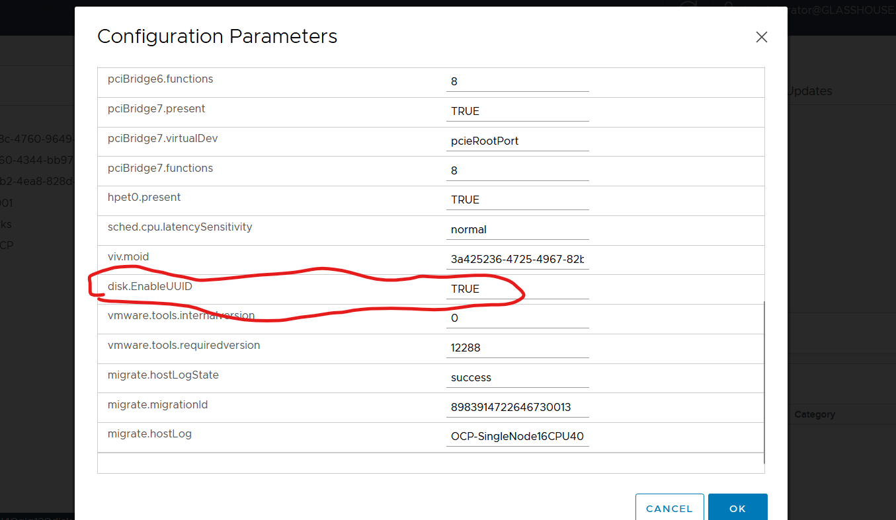

# Provision Openshift Cluster on VMware Workflow

This workflow provisoning a single node or 3 node Openshift cluster on WMware. The workflow has been tested using static IPs for both node types. For single node you just need one IP address. For 3 node cluster you need 5 IPs. One for each node and 1 for API and 1 for ingress. The IPs for nodes must be routable on VMware network for the VMs.    

The above workflow needs 3 targets. These targets require the Intersight Assist appliance to access.
 - Powershell Target for Active Directory DNS automation
 - ESXi SSH Target for downloading Redhat Openshift dicovery ISO
 - vCenter Target standard VMware Target for Intersight Virtualization Services  

## Powershell Target Details

Powershell Target with local administrator account for login and password. Use Intersight help instructions for creating the Powershell Target and running script for powershell access.

## ESXi SSH Target
This must be one of your ESXi Servers in the Cluster that has access to the Datastore. Login should be root and password for root.

## vCenter Target
vCenter Target for the vCenter where the VMs are to be provisioned. The is the same target used for the Intersight Virtualization Services to gather inventory information. 

## VMware Templates

You must create VMware Templates for the VM Nodes. The template just contains the VMware configuration and no operating system. The minimum requirement for a Sign Node cluster is a VM with 16 vcpus, 39 Gig Memory and 120 gig disk. For three node cluster I suggest 8 vcpus 16 gig memory and 120 gig disk. Each Templates need the following configuration parameter. 

## Workflow Input Variables

The workflow has many input variables. Most are one time changes that can be updated after importing the workflow. All the one time parameters have default values with no operator override so they will not show up during execution of the workflow unless you change the override option. The variables that have override options are things like IP address, cluster name,etc that are variables that need to be changed with each execution. 
